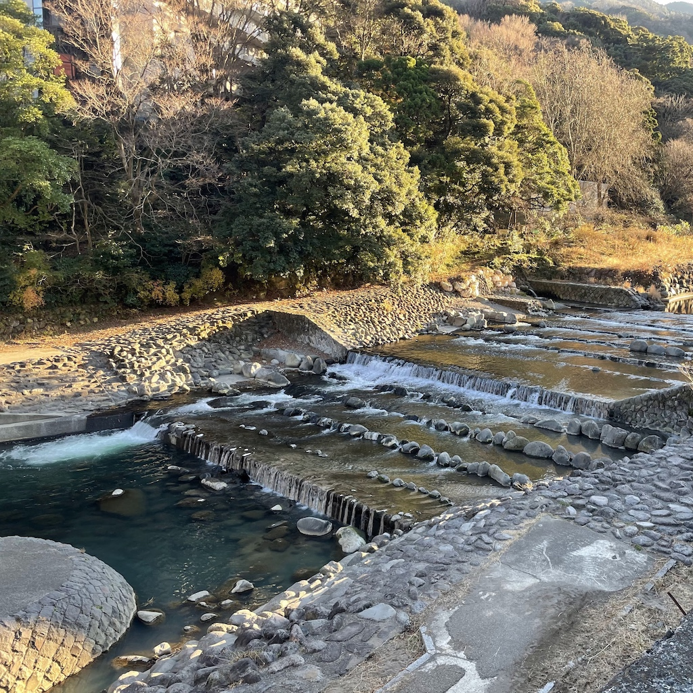

# Hakone: HTTP packages for PHP 🏃‍♀️

**Hakone** is a collection of [PSR](https://www.php-fig.org/)-based HTTP libraries. These packages focus on generality and type safety.

## What does "Hakone" mean?

[Hakone](https://en.wikipedia.org/wiki/Hakone) is a scenic area in the southwest of Tokyo.
The [Hakone Ekiden](https://en.wikipedia.org/wiki/Hakone_Ekiden) is a **relay** marathon run by famous Japanese university students held every New Year's holiday between Tokyo and Hakone.
The word "Hakone" is synonymous with the relay marathon for the Japanese, and is intended as a tribute to the [**Relay PHP**](https://relayphp.com/).

## What is the icon?

This beautiful photo is of [the Hayakawa River](https://en.wikipedia.org/wiki/Haya_River_(Kanagawa)) that flows by [Hakone-Yumoto Station](https://en.wikipedia.org/wiki/Hakone-Yumoto_Station).  
Here you can easily access beautiful scenery and great [Onsen (hot springs)](https://en.wikipedia.org/wiki/Onsen) from [Shinjuku, Tokyo](https://en.wikipedia.org/wiki/Shinjuku).

